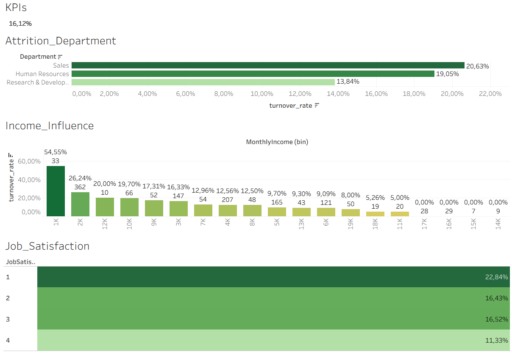
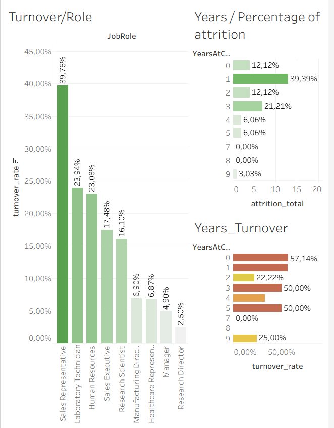

# 📊 Employee Turnover Rate Analysis
## 📖 Intro
We work as People Analysts for a Life Sciences company, and corporate has asked us to identify employees with a higher risk of attrition.
This project features interactive dashboards designed in Tableau to analyze employee turnover rates & behaviour. The main objective is to identify patterns, evaluate risk factors, and uncover the root causes driving talent attrition within the organization.

The main question we aim to answer is: **Which employees present the highest flight risk?**

## 🛠️ Data
* **Source:** For this analysis, we used the "HR Analytics Employee Attrition & Performance" dataset, sourced from Kaggle.
* **Cleaning and Transformation:** The data was processed in Tableau by selecting the relevant columns, removing null values, and transforming parameters.

---

## **DASHBOARD 1 - Attrition filtered by department**
👉 Click the dashboard to interact with metrics

### 🎯 Analysis Objectives
* **Identify** departments or roles with the highest turnover rates.
* **Analyze** demographic and workplace variables (salary & job satisfaction) that impact employee retention.
* **Provide** actionable insights for Human Resources (HR) teams to improve retention strategies.

### 🔍 Dashboard 1: Key Findings and conclusions
* The highest turnover rate is found in the Sales department at 20.63%. Overall, 54.55% of the employees in the 1K monthly income bin has left the company. Additionally, 22.84% of the employees reportiong the lowest job satisfaction score have attrited.
* In sales department, income highly explains the attrition, showing an 80% turnover rate in the 1K salary bin. In the HR department, the most influential factor is job satisfaction, wich drives a 45.45% attrition rate at lowest job satisfaction level (excluding income outliers consisting of only 1 or 2 employees). In Research & Development department, the salary is also the primary factor, showing 40.91% attrition rate in the 1k bin.

### 🤝Conclusions
* Across most departments, low salary (specifically within the 1K bracket) is the most consistent driver of attrition. However, the HR department stands out as an exception, where poor job satisfaction is the most critical risk factor for turnover.

**Hypothesis:** Preliminary observations suggest that employees with fewer years at the company exhibit the highest turnover rates, assuming that lower salaries generally correlate with newer employees. To properly validate this hypothesis and investigate the exact relationship between time spent at the company and flight risk, we will develop a second dashboard dedicated to this metric.

## **DASHBOARD 2 - Year of attrition filtered by role**
👉 Click the dashboard to interact with metrics

### 🎯 Analysis Objectives
* **Identify** years at company with higher turnover rate and percentage of attrition.
* **Analyze** the influence of the job role on employee retention.
* **To carry on** retention strategies at target employees.

### 🔍 Dashboard 2: Key Findings
* The **Sales Representative role** presents the highest **turnover rate at 39.76%**, followed by Laboratory Technician at 23.94%.
* The Years_Percentage of attrition chart shows that **27.19%** of all attrition across the company happens at **Year 1**, followed by Year 2 at 12.44%.
* The Years_Turnover graphic shows that the **provability of leaving the company** is heavily concentrated at **year 0 (36.36%)** and year 1 (34.50%).
* The impact of Roles & Promotion: **57.14% of departing Sales Representatives leave at Year 0** and 56.52% at Year 1. This entry-level role suffers a critical turnover rate in their first years. However, for the more senior **Sales Executive** role, this early flight risk drops down to **33.33% at Year 0** and 25% at Year 1.
* A similarly critical trend is visible for **Laboratory Technicians**, who experience a massive **turnover rate of 63.64%** at Year 0 and 42% at Year 1, with 34.43% of their total attrition concentrating at the year 1.

### 🤝Conclusions
* The probability of an employee leaving is at its absolute highest during their first year. This points to a systemic issue with the recruitment process, false job expectations, or a weak onboarding experience.
* When looking the total volume of departures across the entire company, over quarter of them happen at the year 1. If an employee survives their first two years, their flight risk drops significantly.
* The attrition in heavily concentrated at the entry-level positions. Once employees reach a certain level of seniority or compensation, they tend to stay.

---

## 🚀 Strategic Recommendations for HR and Leadership

To mitigate flight risk and reduce replacement costs—especially for entry-level talent—we propose the following action plan:

* **Revamp Onboarding:** Implement mandatory 30, 60, and 90-day check-ins for *Sales Representatives* and *Laboratory Technicians* to provide support during their highest flight-risk window.

* **Improve the Compensation System:** Implement an incentive bonus structure specifically designed to retain entry-level roles. 

* **Clarify Career Pathing:** The data proves that progressing from *Sales Rep* to *Sales Executive* drastically reduces turnover risk. We must clearly outline the milestones required to earn a promotion.
  
* **Conduct Exit Interviews:** Launch structured "Exit Interviews" for departing HR employees to uncover and resolve the root causes of their low job satisfaction, which is the primary driver of attrition in this department.

👉 **[Click here to view more interactive dashboards on my profile of Tableau Public](https://public.tableau.com/app/profile/marc.mateu.higueras/viz/Dashboard_Rotacin_Empleados/Dashboard1?publish=yes)**

---

### 🛠️ Tools Used
* **Tableau:** Data visualization and dashboard creation.
* **Git & GitHub:** Version control and portfolio hosting.
